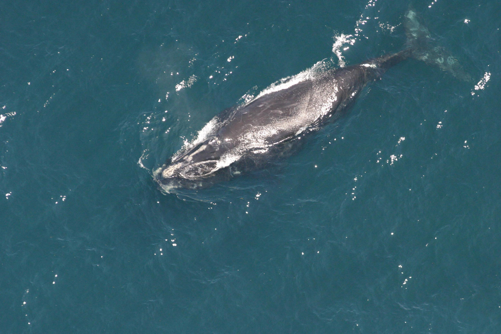
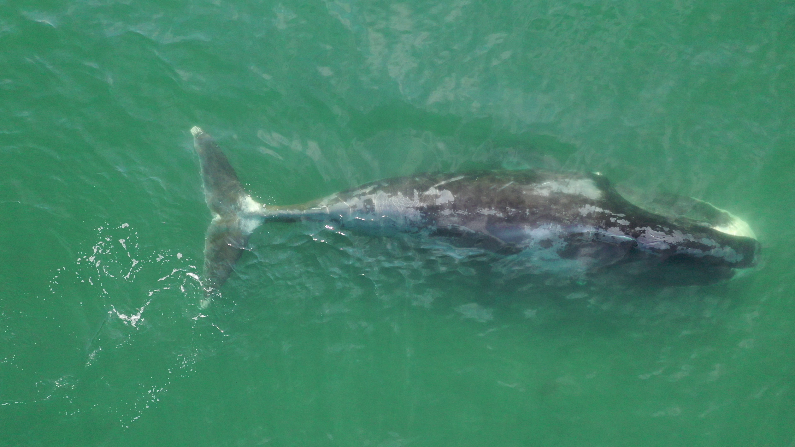

# Automated Approaches to Bowhead Whales
By **Sam Gregory** and **Kacey La**\
Advised by **Dr. Chris Tralie** and **Dr. Leslie New​**\
<code>**Ursinus College** - **Summer Fellows**</code>

>**Presentations:** \
> Week 2 - <a href="slides/Week2.pdf" download>Slides</a>\
> Week 4 - <a href="slides/Week4.pdf" download>Slides</a>\
> Week 6 - <a href="slides/Week6.pdf" download>Slides</a>\
> Week 8 - <a href="slides/FinalPoster.pdf" download>Final Poster</a>

>**Source Code:** \
>[Website](https://github.com/ursinusbowheadwhales/bowhead_web)

## Overview

In marine conservation and ecology, identifying bowhead whales plays an important role in understanding population and migration patterns. However, the identification of bowhead whales can be time-consuming, often taking months for experts to individually identify each whale given a large amount of data. Thus, this project aims to automate the identification of bowhead whales using convolutional neural networks. We outline our methods and successes as well as our setbacks and failures in this website.​

## Transfer Learning with Right Whales​

One of the biggest problems we encountered was the little amount of data received. It was difficult to set up a classification neural network when there were only ~40 bowhead whales images and 3 videos to train from. Thus, we focused on using previous whale identification problems to help in transfer learning, specifically the Kaggle 2015 right whale recognition competition. Unlike the right whales, which are identified by the callosities on their heads, bowhead whales are identified by the combination of white patterns and scars on their fluke, back, and head. We used the right whales to train a neural network to identify 9 key points on the outline of the whale. These points were then used to segment each whale by their fluke, back, and head, which were then combined into a final classifier to identify bowhead whales.
&nbsp; 
<table>
    <tr>
        <td>Right Whale</td>
        <td>Bowhead Whale</td>
    </tr>
    <tr>
        <td></td>
        <td></td>
    </tr>
</table>

**Figure 1:** Difference between the right and bowhead whale. Notice the callosities on head of the right whale and the white patterns on the bowhead whale. Although they are different types of whale, both share the same general structure with the fluke, back, and head.