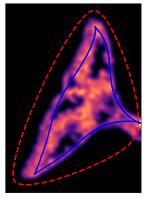

# Preprocessing
In order for classification to succeed, the bowhead whale needed to be segmented from the ocean and be in a right-horizontal orientation. Our initial approach included classical techniques such as thresholding and canny edge detector to separate the whale from the ocean. However, we found some to little success as some whales proved to be difficult to segment and inconsistent across images. Eventually, we settled with segmenting the whale through key points. We discuss our results below.

## Classical Techniques

#### Successes
- **Catmull-Rom Spline** - Helped carve out each section of the whale after identifying the key points

#### Neutral
- **Histogram Equalization** - Helped make the color palette consistent across each image. However, did not affect results while training the neural network to learn the key points 

#### Failures
- **Canny Edge Detector** - Inconsistently captured the edge of the whales across each whale

- **Thresholding** - Even when using the median value of the image, thresholding wouldn't always work on certain images, often confusing the whale for water

- **Active Contour (Snakes)** - Active contour either had difficulty collapsing onto the edges of the tail and worked inconsistently across each image


## Point Identification

We used a Python library called OpenCV to create a simple user interface (UI) to mark key points on the whales. These points would be stored in a JSON file and then used to extrapolate a bounding box for the whale. We initially began with three key points: two on the corners of the fluke and one at the tip of the head. 

<table>
    <tr>
        <td>Right Whale</td>
        <td>Bowhead Whale</td>
    </tr>
    <tr>
        <td></td>
        <td></td>
    </tr>
</table>

**Figure 2:** Example of the three key points labeled on the right and bowhead whale

However, these points proved difficult to use, especially in cases where the whale's body was curved or the tail and head position made it difficult to extrapolate a bounding box. Thus, we settled with 6 additional points on the perimeter of the whale: two on the sides of the head, two on the body, and two on the tail. It's important to note that these points were labeled such that the whales are oriented the same way if rotated.


<table>
    <tr>
        <td colspan="2">Key Point Labeler UI in OpenCV</td>
    </tr>
    <tr>
        <td colspan="2"><center></center></td>
    </tr>
    <tr>
        <td>Right Whale: Facing Right</td>
        <td>Right Whale: Facing Left</td>
    </tr>
    <tr>
        <td></td>
        <td></td>
    </tr>
</table>

**Figure 3:** The top image shows the OpenCV key point labeler while the bottom two images are examples of labeling

**Top:** Key point labeler UI \
**Bottom:** Example of labeling on a right whale facing left and right

Below is the structure of the JSON file after labeling all 2,114 whales

```js
{
    "0_2020_Whale.jpg": {
        "TailLeft": [1037, 0], --> (x, y) coordinates
        "TailRight": [1040, 445],
        "UpTailLeft": [1390, 47],
        "UpTailRight": [1387, 137],
        "BackLeft": [2301, 3],
        "BackRight": [2344, 281],
        "HeadLeft": [3107, 3],
        "HeadRight": [2928, 245],
        "Head": [3240, 76]
   },
   And so on for the rest of the 2,113 whales...
}
```

## Segmenting
The points were also pushed out more outside of the perimeter of the whale to ensure all parts were captured. From there, the **Catmull-Rom spline** algorithm was applied to carve out the head, body and fluke. 


**Figure 4:** Example of key points being pushed outside with the **Catmull-Rom spline** applied to the entire whale


We attempted to use the active contour algorithm to further crop each individual part. However, it was difficult to find the "correct" parameters for active contour to even collapse onto the tails as shown in **Figure 6**. But even then, the parameters wouldn't work across all the whale images. Thus, we settled with keeping the cropped images created by the **Catmull-Rom spline** algorithm.

<table>
    <tr>
        <td colspan="2">Active Contour Failure</td>
    </tr>
    <tr>
        <td></td>
        <td></td>
    </tr>
</table>

**Figure 5:** Example of failed attempts using the active contour algorithm on a right whale's tail

## Orientation
The next issue would be normalizing the orientation of the individual parts. Using the formula in **Figure 6**, we rotated the images of cropped individual parts with the help of our hand-labeled key points.


**Figure 6**: Slide image courtesy of [anlthms]("https://github.com/anlthms/whale-2015/blob/master/object-recognition.pdf") during the [2015 Kaggle Right Whale Recognition Competition](https://www.kaggle.com/c/noaa-right-whale-recognition). 

#### Whale Orientation Points:
  -  **Head**
    - Point #1: Tip of the head <code>(**Head**)</code>
    - Point #2: Midpoint of the two points on the sides of the head <code>(**HeadLeft** & **HeadRight**)</code>
  -  **Body**
    - Point #1: Midpoint of the two points on the sides of the head <code>(**HeadLeft** & **HeadRight**)</code>
    - Point #2: Midpoint of the two points on the tail <code>(**UpTailLeft** & **UpTailRight**)</code>
  - **Tail**
    - Point #1: Midpoint of the two points on the tail <code>(**UpTailLeft** & **UpTailRight**)</code>
    - Point #2: Midpoint of the two points on the fluke corners <code>(**TailLeft** & **TailRight**)</code>

***&ast;Note that the back points are not  used!***

In **Figure 7**, we apply the formula and rotate the cropped tail image by **θ**. There are however, instances where the cropped image was oriented the opposite direction. In that case, we compare the ``x`` values of the two coordinates and rotate the image an additional **180°** if necessary.


**Figure 7:** Example of orienting the cropped tail using the two calculated points

In **Figure 8**, we show some examples of cropping the whale into 3 sub-sections and normalizing the orientation.
<table>
    <tr>
        <td>Full Whale</td>
        <td>Whale Head</td>
        <td>Whale Body</td>
        <td>Whale Tail</td>
    </tr>
    <tr>
        <td></td>   
        <td></td>   
        <td></td>
        <td></td>
    </tr>
        <td></td>   
        <td></td>  
        <td></td>
        <td></td>
    </tr>
        </tr>
        <td></td>   
        <td></td>  
        <td></td>
        <td></td>
    </tr>
</table>

**Figure 8:** Examples of whales of being cropped using the truth key points. The first two images are right whales while the last is a bowhead whale.


